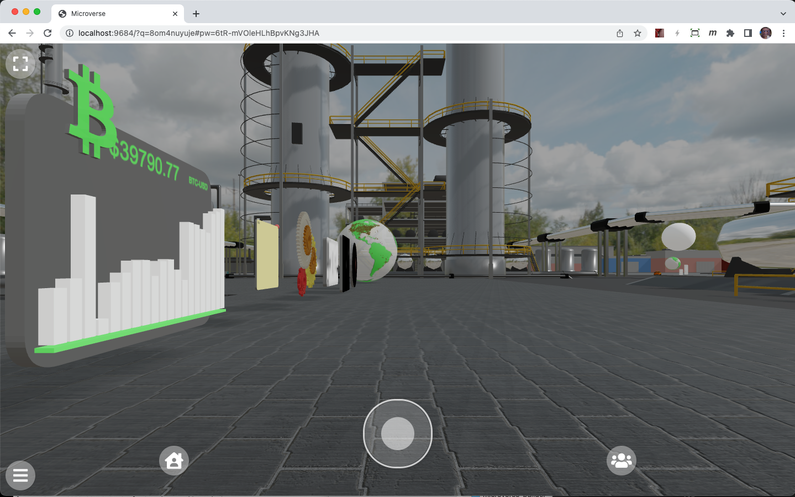

# Croquet Microverse Builder
## Quick Start Guide

***Copyright (c) 2022 Croquet Corporation***

<https://croquet.io>

<info@croquet.io>

## Introduction

This guide will enable you to quickly set up Croquet Microverse Builder and introduce you to a number of key concepts that you will need to know to create your own worlds and apps within those worlds. Not only is it easy to do this, it is incredibly fun and rewarding. 

## TLDR
1. Clone the Github repository <https://github.com/croquet/microverse-builder>
2. Obtain your Croquet API Key <https://croquet.io/developers/index.html>
3. Create the apiKey.js file from apiKey.js-example and the API Key above.
4. Open a terminal and set the path to your new Microverse-Builder folder.
5. run `npm i`
6. run `npm start`
7. Open browser at `localhost:9684` and enter a new world.
8. Create your own worlds.

## Croquet Microverse
---

Croquet Microverse Builder is a multi-user development and deployment system built on top of the Croquet Web-based operating system. This document will get you started creating your own microverses that you can deploy anywhere you like.

## Croquet OS
---
The Croquet OS is a software system for creating and deploying multiuser digital experiences on the web. It lets you build real-time multiuser apps without writing a single line of server code, or deploying or managing any servers. Croquet is available as a JavaScript library that grants access to our global network of public reflectors. These reflectors provide seamless cross-platform real-time interactivity to any user with a network connection and a web browser.

## Resources
---

### Croquet.io
<https://croquet.io> is the best place to get started with what Croquet Microverse is and what it can do. 

### Discord

The best resource for help in developing Croquet Microverse worlds is on our Discord server where you can ask questions, view examples, and see the Metaverse being constructed while you watch. Check it out here:
<iframe src="https://discord.com/widget?id=694586717247635488&theme=dark" width="350" height="500" allowtransparency="true" frameborder="0" sandbox="allow-popups allow-popups-to-escape-sandbox allow-same-origin allow-scripts"></iframe>

## Steps Towards Creating Your Microverse
---

### 1. Clone the Github Repository

You can find the most up to date Croquet Microverse library as well as this document in the Microverse-Builder Github repository. Cloning this repository will give you almost everything you will need to get started creating your own Croquet Microverse.
<https://github.com/croquet/microverse-builder>

---
### 2. Obtain your API Key

Developing any Croquet application requires an API key that you can obtain for free from Croquet. It requires you to sign up as a developer to access this. You can sign up as a Croquet developer here:
<https://croquet.io/developers/index.html>

Select the [Sign Up](https://croquet.io/keys/login.html) button in the top left to create a Croquet account to get started. Once you have done that, your first key is immediately generated and you will soon be ready to go. 


---
### 3. Create the apiKey.js File
Create a file called `apiKey.js` by copying `apiKey.js-example` to `apiKey.js` and then edit the two properties called `apiKey` and `appId` in the file. 

#### apiKey.js-example

```
const apiKey = "<insert your apiKey from croquet.io/keys>";
const appId = "<specify your own appId such as com.foo.mymicroverse>";
export default {apiKey, appId};

// you may export other Croquet session parameters to override default values.
```

Place your Croquet generated API keys and application ID into this and save the resulting file as apiKey.js.

#### apiKey.js
```
const apiKey = "1_a2b3c4e5f6g7h8i9j0kxyzzyqwerty142nsj6fasdsadad";
const appId = "io.croquet.david.awesome-app";
export default {apiKey, appId};
```

### 4. Start Croquet Microverse

The next steps are simple. Open a terminal on your computer and set the path to the new microverse-builder folder.

First run `npm install` in the directory.

Then run `npm start` in the same directory. This will run two servers. One is the file server on localhost:9684. The other is the watch-server that enables you to inject code changes into a running session. You can also run them separately by running `npm run file-server` and `npm run watch-server`.

You should see something similar to this:


Not only have you completed installation of Croquet Microverse Builder, but you can run it right now to give it a try. Open your web browser and type in:

`localhost:9684`

Once you have done that, the demo world for Croquet Microverse will load and you are ready to go. The URL will change - both a new session ID and a password are autogenerated. This full URL is what allows you to share your new world with other users.



Your new Microverse awaits...

### 5. The Watch Server
The watch server enables you to edit code from your own IDE and have it injected and run inside the Croquet Microverse while it is running without the need to reload. The watch server is automatically launched when execute `npm start`. You can start the watch server on its own by running `npm run watch-server`. The watch-server by default starts watching the directory called `behaviors`. If you want to create a separate set of behavior files in a different directory, you supply an argument to the watch-server by `npm run watch-server -- aDirectory`.

## A Brief Tour of the Microverse
---


## Cards and Behaviors
---
Every visible object in a Microverse is the same kind of object that we call a card. Some cards are flat like normal cards, and some cards are 3D models. We call them cards because the majority of the applications and interface objects will be flat. Also, we were inspired by Bill Atkinson's Hypercard, which demonstrated a new way of creating powerful applications. All cards are composable in that the developer can create decks made up of multiple cards. The cards in this deck can communicate with each other using a simple publish/subscribe model call "sayDeck" and "listenDeck".

Behaviors are code objects that can be applied to a card. They enable the card to interact with the user, other cards, and even the live external world. 

## Constructing a New Card
---

### Flat Cards
---

### 3D Cards
---

## Behaviors
---

## Portals
---

## Croquet Microverse References
Croquet Microverse is built on top of a number of other systems. The most important is the Croquet OS and the Croquet Worldcore framework. It isn't essential that you be familiar with these but you may find them useful in understanding the basis of how Croquet Microverse operates.

[Croquet Documentation Main Page](https://croquet.io/docs/)

The [Croquet OS kernel](https://croquet.io/docs/croquet/) is an extremely low-latency multi-user replicated computation platform. 

The [Worldcore framework](https://croquet.io/docs/worldcore/) defines the actor/pawn architecture underlying the Croquet Metaverse cards. 

[Three.js](https://threejs.org) provides the 3D rendering framework. It is an extremely powerful, flexible and well defined library. 

Croquet Microverse utilizes the [Rapier Physics Engine](https://rapier.rs/). Written in Rust and running in WebAssembly, Rapier is an open source, very high-performance but easy to create multiuser, interactive physics simulations.


# Installation Guide for Croquet Microverse (April 14th, 2022)


## 6. Press the Connect button in the world menu
After launching Microverse by visiting http://localhost:9684 in Chrome bring up the world menu from bottom left, and press "Connect". This will establish the connection to the watch-server started in step 4.

## 7. Edit or add a new file
You can simply add a new file in the watched directory (by default `behaviors/default/`), and if the file follows the structure of other files, it will become automatically available.

## 8. Make a new world file
You can add a new file in the "worlds" directory (copying default.js or test.js is an easy way).  If you start microverse with ?world=fileBaseName, the file at `worlds/fileBaseName.js` is used to start the world.

## 9. Note on the persistence
The system stores the "persistent data" once about 60 seconds if there was some activity. When you edit your behavior code, or update the system, Croquets start a fresh session but re-loads contents from the persistent data. One thing to note is that the content in the world file that the world is originally created from is not used to initialize this new session. Consider the world file as the starting point of a world, but editing it does not affect the world since it is created.


# Markdown Examples


_Italic Text_   

---   
**Bold Text**  
> This is a quote  

`forEach()` this is code  

```Javascript
    //this is a comment
    let b = Math.cos((1 - d) * Math.PI);
    b = Math.min(1, (b + 1) / 1.25);
    let g = Math.sin(d * Math.PI);
    g = (g + 1) / 2.2;
    let r = Math.cos(d * Math.PI);
    r = Math.min(1, (r + 1) / 1.25);
```

```json
{
  "firstName": "John",
  "lastName": "Smith",
  "age": 25
}
```

This is a ==hilite==  

1. First item
2. Second item
3. Third item

[Three.js](https://threejs.org)

| this | is | a | table |
| ----- | ---- | ----- | ---- |
| And | so | is | this |
| How | are | you | today |
| what | is | new | ? |

First definition term 
: This is a definition


