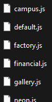
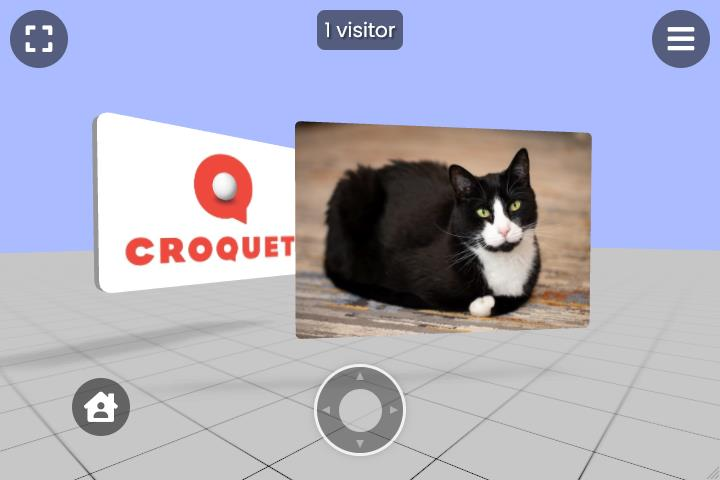
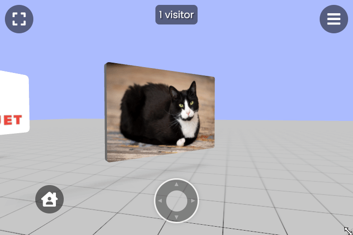
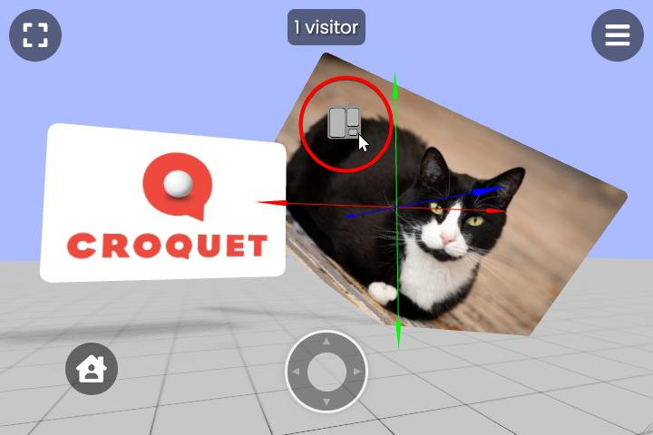
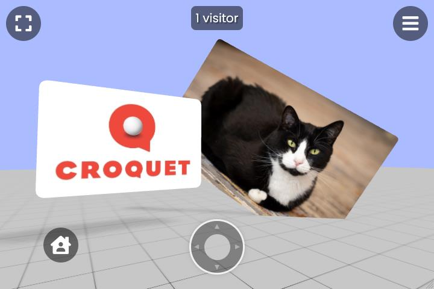
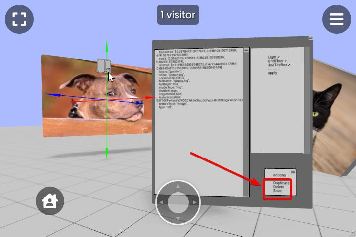

# Adding Persistent Content to a Microverse World

## Goals
This tutorial assumes that you have Microverse running locally. To do so, follow the [Quick Start Guide](./QuickStart.md).

## Defining "Microverse World Templates"
Inside your `microverse` source directory, you will see a subdirectory named `worlds`.

Each of the JavaScript files within `worlds` are called World Templates. A World Template file defines the contents of a Microverse World.

<p align="center">

</p>

For example, `tutorial1.js` defines:
- The names of the avatars that will appear in the Tutorial1 Microverse World, such as `"newwhite"` and `"madhatter"`.
- The locations of the Behavior module files that will be used by cards in the Tutorial1 Microverse World.
- The Cards that will appear in the Tutorial1 Microverse World, such as:
    - The world model
    - The skybox image
    - The Auggie award model

When you run Microverse locally, you can visit the Worlds defined by these JavaScript files by visiting a specific URL. To visit the Microverse World defined by `tutorial1.js`, you would visit [http://localhost:9684/?world=tutorial1](http://localhost:9684/?world=tutorial1).

You can replace `tutorial1` with another `.js` filename from `/worlds` to visit a different Microverse World.

## Defining "A Microverse World **Session**"
When you drag and drop assets such as images, PDFs, or `.glb` 3D models from your local disk into a Microverse World Session, that asset automatically becomes a Card within your Session. You can see that asset, move it around, rotate it, scale it, and modify it as you wish.

<p align="center">

</p>

**These newly-added assets persist in that Microverse World Session, and only in that Session.**

Microverse World Sessions are defined by the `q` query parameter in your browser's URL bar. For example, the following URLs will take you to two *unique Sessions* within Croquet.io's Gallery Microverse World:

- [https://croquet.io/gallery/?q=sessionONE#pw=password1](https://croquet.io/gallery/?q=sessionONE#pw=password1)
- [https://croquet.io/gallery/?q=sessionTWO#pw=password2](https://croquet.io/gallery/?q=sessionTWO#pw=password2)

The `q` query parameter in the first session is `q=sessionONE#pw=password1`. The `q` query parameter in the second session is `q=sessionTWO#pw=password2`.

A person who visits the first URL will not see the avatar of anyone who visits the second URL.

Similarly, if someone adds content to the first Session, someone else in the second Session will *not* see that content.

If you add a picture of a cat to the first Session, then close that browser tab, then return to the first Session, you will see that same picture of the cat.

## Adding Content to a Microverse World Template

In this tutorial, we will learn how to modify the `tutorial1.js` World Template file to include this picture of Mosby the cat:

<p align="center">

</p>

As a result, everyone who joins a new Microverse World Session defined by our modified Tutorial1 World Template will see that picture of Mosby the cat.

1. Start Microverse locally with `npm start` from within your `microverse` source directory.
2. Download the picture of Mosby the cat (`mosby.jpg`) to your local disk.
3. Visit [http://localhost:9684/?world=tutorial1](http://localhost:9684/?world=tutorial1) in your browser.
    - Notice that you are automatically redirected to a specific, random Session. Your URL changes to reflect the random session to which you were redirected.
4. Drag `mosby.jpg` from our file explorer into the Tutorial1 Microverse World.
    - You should now see `mosby.jpg` in 3D space within the Microverse World.
5. `Ctrl+Click` on the Mosby Card within the world to bring up the Translation Gizmo. You can use that Gizmo to move the Mosby Card in 3D space:
    <p align="center" style="margin:16px;">
        
    </p>
6. `Ctrl+Click` on the Mosby Card again to bring up the Rotation Gizmo. You can use that Gizmo to rotate the Mosby Card in 3D space.
7. `Ctrl+Click` on the Mosby Card again to bring up the Scale Gizmo. You can use that Gizmo to scale the Mosby Card in 3D space.
8. Now that you are satisfied with the position, rotation, and scale of the Mosby Card, it's time to add that Card to the Tutorial1 World Template. Open `tutorial1.js` in your code editor.
9. Inside the `Constants.DefaultCards[]` Array, add a new empty Card Object with this code:
    ```JavaScript
    {
        card: {
        }
    },
    ```
10. `Ctrl+Click` on the Mosby Card, then click on the Card's Property Sheet button:
    <p align="center" style="margin:16px;">
        
    </p>
11. Click within the Card's properties text on the left side of the Property Sheet, and select all of the text.
    - You can use `Ctrl+A` (`Cmd+A` on MacOS) to select all of the property text.
12. Copy all of the properties to your clipboard with `Ctrl+C` (`Cmd+C` on MacOS).
13. Paste those property key/value pairs into the new Card Object inside `tutorial1.js` that you created above.
    - For example, you might see code like this in `tutorial1.js`:
        ```JavaScript
        {
            card: {
                translation: [4.369945765399226, 0.4962352187860626, -9.726996673482539],
                scale: [6.682910798711366, 6.682910798711366, 6.682910798711366],
                rotation: [0.09812348017221662, -0.3332045514176837, -0.26490064752929465, 0.8995410810474379],
                ...<snip>
            }
        },
        ```
14. Save your modified `tutorial1.js`.

Now, everyone who visits [http://localhost:9684/?world=tutorial1](http://localhost:9684/?world=tutorial1) - no matter what Session they join - will see your precisely-positioned Mosby Card in the 3D world.

<p align="center">
    
</p>

You can test this yourself: Open [http://localhost:9684/?world=tutorial1](http://localhost:9684/?world=tutorial1) in a brand-new browser tab so that you join a new Session. Mosby will be there, greeting you with a perfect cat loaf.

You can repeat these steps with other content that you add to your Microverse world to make them show up by default, across all Sessions. For example, you could add a 3D model of a castle to the Tutorial1 World Template so that everyone who shows up to your Tutorial1 World will see that castle.

## Exporting and Sharing Individual Cards
There are times during World development when you may want to bring a Card from one Microverse session into another.

For example, let's say that you are working inside Session A. Inside Session A, you have added to the 3D world an image of a puppy on a Card.

At that time, if you were to join Session **B**, you would no longer see the Puppy Card you added in Session A. How can we get the Puppy Card from Session A into Session B without re-uploading the puppy image? The answer is to use a `.vrse` file:

1. Download `puppy.jpg` from here:
    <p align="center" style="margin:16px;">
        
    </p>
2. Start a new Microverse `Tutorial1` session by visiting [http://localhost:9684/?world=tutorial1](http://localhost:9684/?world=tutorial1) in a brand-new browser tab.
3. Create your Puppy Card in this session by dragging and dropping `puppy.jpg` into the world.
4. `Ctrl+Click` on the Puppy Card, then open the Puppy Card's Property Sheet.
5. Click on the "Save" button in the bottom right:
    <p align="center" style="margin:16px;">
        
    </p>
6. Your Downloads folder will now contain a small `.vrse` file named `_puppy.jpg.vrse`.
    - `.vrse` files are plain text files. You can open them in your favorite text editor to see what they contain.
    - `.vrse` files do not directly contain image data, so the filesize is significantly smaller than the filesize of an original image.
7. Join a brand new session by visiting [http://localhost:9684/?world=tutorial1](http://localhost:9684/?world=tutorial1) in a new browser tab.
    - You should _not yet_ see your Puppy Card from the earlier steps, because the Puppy Card is not a part of the `tutorial1.js` Template.
8. Drag and drop `_puppy.jpg.vrse` from your Downloads folder into this new Session.

A Puppy Card should now be visible in your current session.

When you import a `.vrse` file into a session, certain Card properties, such as translation, rotation, and some behaviors, are **not preserved**.

## Conclusion

We hope you enjoy building with Microverse World Builder, and we look forward to interacting with your creations. See you in the Open Metaverse!

**Copyright (c) 2022 Croquet Corporation**
