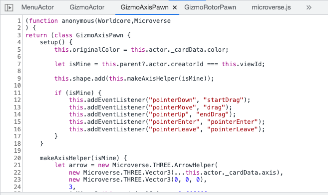
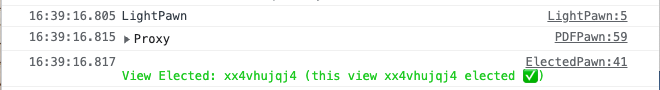
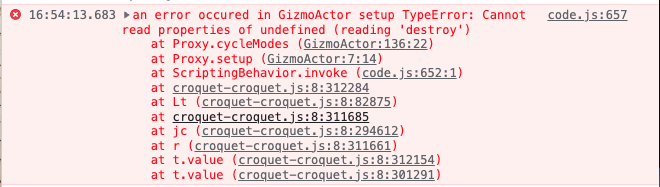
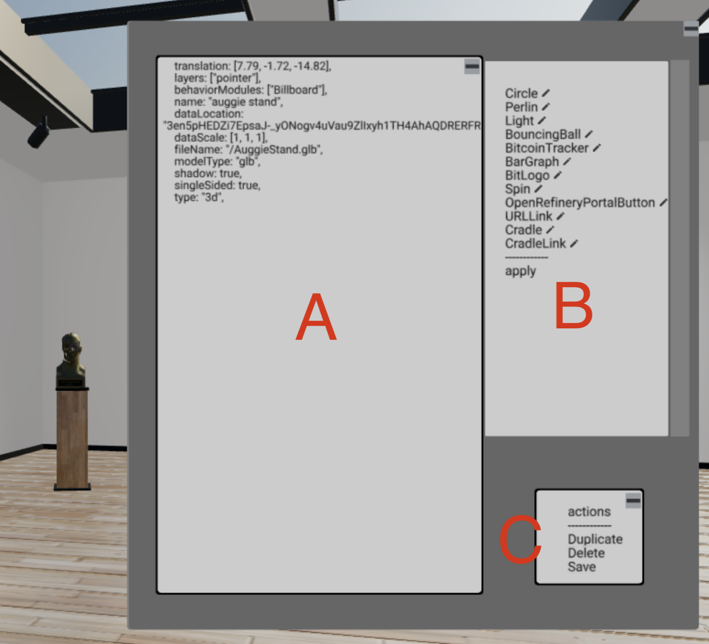

# Croquet Microverse Development Guide

## Introduction

Croquet Microverse allows you to create a multiuser virtual 3D world. You can add new 3D objects, change their properties, and write their "behaviors" dynamically, all while you and other users are in the same world.

Every object you create in the world is called a "card". A card can be in any shape and size. Some cards are flat, some hold 3D models, some cards' visual representation are generated programmatically by a behavior. Even the terrain model on which the avatars walk is a card with a 3D model. You can typically drag and drop a 3D model file or an image into a running world to create a card. You can also write a simple specification file to start a new world.

Cards communicate with each other using the [Croquet's publish/subscribe mechanism](https://croquet.io/docs/croquet/) to trigger actions.

A behavior is an object-extension mechanism. It is like a subclass of a card which can be attached and detached to a card dynamically. Attached behaviors can enhance features of the "actor" (the model) of the card as well as the "pawn" (the view).

Therefore, creating a Croquet Microverse world means to arrange your 3D objects in the world, including the terrain model, and specify behaviors to some objects. Other user can join a world where you can collaboratively create it.  Once you are satisfied, the world definition can be saved into a file, or card specifications can be extracted to the world file.

## Start a demo world
You can specify the starting point of a session by giving a URL parameter `?world=`. If the value for this parameter does not end with `.vrse`, the value is interpreted as the name of a file in the `worlds` directory, and corresponding `.js` file is used as template. If the value ends with .vrse, it is interpreted as a URL for a .vrse file saved from the Save menu. The VRSE file can be a URL for a public place like GitHub Gist.

One of the demo worlds in the repository is called `tutorial1`, and can be entered by opening [http://localhost:9684/?world=tutorial1]([http://localhost:9684/?world=tutorial1])


## Use `npm create croquet-microverse`

Instead of cloning the main github repository, you can also create a minimum set of files to run Croquet Microverse which you can use as a starting point of your own project. Create an empty directory and run

    npm create croquet-microverse

## World Template File

Tutorial1 is made up of three cards (not including the avatars). There is a floor card, which allows us to walk around.  A light card that lets us see the world around us. And a flat card with the Croquet logo on it. The code defining this world can be found in the `worlds` directory. Open microverse/worlds/tutorial1.js in your text editor to see the following code. The init function is used to define the objects that make up the world.

The first value is Constants.AvatarNames, which specifies the name of the 3D model files in microverse/assets/avatars folder. When you add your own avatars, you can simply place them in the same folder and specify their names here.

```Javascript
export function init(Constants) {
    Constants.AvatarNames = [
        "newwhite", "fixmadhatter", "marchhare", "queenofhearts", "cheshirecat", "alice"
    ];
```

The next section defines the various behaviors we will be attaching to our cards. Typically you create a directory for your behavior modules for the world you are creating, and list them in this section.

```Javascript
    Constants.UserBehaviorDirectory = "behaviors/tutorials";
    Constants.UserBehaviorModules = [
        "lights.js", "gridFloor.js", "joeTheBox.js"
    ];
```

The final section is where we define the cards. A card is defined by a number of parameters including the name, type, its initial location, scale, orientation, etc. (The full specification of parameters is described in `CardSpec.md` in the docs directory.)

You can also specify a list of behaviors for a card. A behavior can define the visual representation, how it acts when a user interacts with it, or how it can access live external data streams.  In the example below, the first card, named the "world model" is defined by the "GridFloor" module. We will take a look at that shortly. The second card, named "light", defines the lighting in this world.  The third card, named "image card", is an example of a typical card in the Croquet Microverse.  It creates a floating object in the middle of the scene with the Croquet logo applied.

```Javascript
    Constants.DefaultCards = [
        {
            card: {
                name: "world model",
                behaviorModules: ["GridFloor"],
                layers: ["walk"],
                type: "object",
                translation:[0, -2, 0],
                shadow: true,
            }
        },
        {
            card: {
                name: "light",
                layers: ["light"],
                type: "lighting",
                behaviorModules: ["Light"],
                clearColor: 0xaabbff,
            }
        },
        {
            card: {
                name: "image card",
                translation: [0, 0.4, -10],
                scale: [4, 4, 4],
                type: "2d",
                textureType: "image",
                textureLocation: "./assets/images/CroquetLogo_RGB.jpg",
                frameColor: 0xcccccc,
                color: 0xffffff,
                cornerRadius: 0.05,
                depth: 0.05,
                shadow: true,
            }
        },
    ];
```

## Behaviors

Behaviors are a class extension mechanism in the Croquet Microverse. It is like subclassing to enhance a card, but you can attach and detach a behavior to/from the actor and the pawn dynamically.

Since a behavior typically requires an actor side and pawn side to work together, we package list of behaviors for the actor and pawn which are separate into an entity we call the "behavior module", 

From our tutorial1, let us look at the behaviors in the GridFloor module.

```
// Grid Floor
// Croquet Microverse
// Generates a simple gridded floor card

class GridFloorPawn {
    setup() {
        let THREE = Microverse.THREE;
	let gridImage = "data:image/png;base64,iVBORw0KGgoAAAANSUhEUgAAAEAAAABACAYAAACqaXHeAAAABHNCSVQICAgIfAhkiAAAAAlwSFlzAAAOnAAADusBZ+q87AAAAJtJREFUeJzt0EENwDAAxLDbNP6UOxh+NEYQ5dl2drFv286598GrA7QG6ACtATpAa4AO0BqgA7QG6ACtATpAa4AO0BqgA7QG6ACtATpAa4AO0BqgA7QG6ACtATpAa4AO0BqgA7QG6ACtATpAa4AO0BqgA7QG6ACtATpAa4AO0BqgA7QG6ACtATpAa4AO0BqgA7QG6ACtATpAu37AD8eaBH5JQdVbAAAAAElFTkSuQmCC";

        let image = new Image();
        let texture = new THREE.Texture(image);
        image.onload = () => texture.needsUpdate = true;
        image.src = gridImage;

        texture.wrapS = THREE.RepeatWrapping;
        texture.wrapT = THREE.RepeatWrapping;
        texture.repeat.set( 100, 100 );

        if (this.floor) {
            this.shape.remove(this.floor);
            this.floor.dispose();
        }

        this.floor = new THREE.Mesh(
            new THREE.BoxGeometry( 100, 0.1, 100, 1, 1, 1 ),
            new THREE.MeshStandardMaterial({ map: texture, color: 0xcccccc }));
        this.floor.receiveShadow = true;
        this.shape.add(this.floor);
        this.cleanupColliderObject()
        if (this.actor.layers && this.actor.layers.includes("walk")) {
            this.constructCollider(this.floor);
        }
    }
}

export default {
    modules: [
        {
            name: "GridFloor",
            pawnBehaviors: [GridFloorPawn],
        }
    ]
}
```

Since this module only defines the visual representation, it does not have any actor behaviors. The pawn behavior add a new Three.js `Mesh` to `this.shape`, which is the Three.js `Group` that represents the root of the visual apperanace.

### Behaviors Life Cycle

Because behaviors are dynamically attached and detached, one needs to understand their "life cycle".  When the definition of a behavior is edited and updated (via the watch server or in-world editing), the `setup()` method of the edited behavior is called. When a behavior is detached from the card, the `teardown()` method is called. Also note that when the browser tab running the application is hidden, the application may lose the WebSocket connection to the Croquet backend. The Croquet system is designed to automatically reconnects and reconstruct the view smart when the tab comes back to the foreground.  However, it means that the `setup()` method may be called again at that moment.

So it is a typical idiom that the `setup()` method cleans up resources it has created in the previous invocation.

In the `GridFloorPawn` case, we remove the `this.floor` object that may exist when `setup()` is invoked, and then create the new floor Mesh.

The `Microverse` variable contains all of the exported functions and objects from the Microverse system, including many features re-exported from the Worldcore framework. Refer to the [Worldcore documentation](https://croquet.io/docs/worldcore) for what is available. The most commonly used one is `Microverse.THREE`, which contains all exports from Three.js.

Let us look at another module for slightly more involved example of the life cycle.


```Javascript
class SpinActor {
    setup() {
        this.listen("startSpinning", "startSpinning");
        this.listen("stopSpinning", "stopSpinning");
    }

    startSpinning(spin) {
        this.isSpinning = true;
        this.qSpin = Microverse.q_euler(0, spin, 0);
        this.doSpin();
    }

    doSpin() {
        if(this.isSpinning) {
            this.setRotation(Microverse.q_multiply(this._rotation, this.qSpin));
            this.future(50).doSpin();
        }
    }

    stopSpinning() {
        this.isSpinning = false;
    }

    teardown() {
        delete this.isSpinning;
        this.unsubscribe(this.id, "startSpinning");
        this.unsubscribe(this.id, "stopSpinning");
    }
}

class SpinPawn {
    setup() {
        this.addEventListener("pointerDown", "onPointerDown");
        this.addEventListener("pointerUp", "onPointerUp");
        this.addEventListener("pointerMove", "onPointerMove");
    }

    theta(xyz) {
        let origin = this.translation;
        return (Math.atan2(origin[2] - xyz[2], xyz[0] - origin[0]) + Math.PI * 2) % (Math.PI * 2);
    }

    onPointerDown(p3d) {
        this.base = this.theta(p3d.xyz);
        this.baseRotation = [...this._rotation];
        this.say("stopSpinning");
        this.moveBuffer = [];
    }

    onPointerMove(p3d) {
        this.moveBuffer.push(p3d.xyz);
        if (this.moveBuffer.length > 3) {
            this.moveBuffer.shift();
        }
        let next = this.theta(p3d.xyz);
        let newAngle = ((next - this.base) + Math.PI * 2) % (Math.PI * 2);
        let qAngle = Microverse.q_euler(0, newAngle, 0);

        this.say("setRotation", Microverse.q_multiply(this.baseRotation, qAngle));
    }

    onPointerUp(p3d) {
        if (p3d.xyz){ // clean up and see if we can spin
            if (this.moveBuffer.length < 3) {return;}
            let prev = this.theta(this.moveBuffer[0]);
            let next = this.theta(p3d.xyz);
            this.onPointerMove(p3d);
            this.deltaAngle = (next + (Math.PI * 2)) % (Math.PI * 2) - (prev + (Math.PI * 2)) % (Math.PI * 2)
            if(Math.abs(this.deltaAngle) > 0.001) {
                let a = this.deltaAngle;
                a = Math.min(Math.max(-0.1, a), 0.1);
                this.say("startSpinning", a);
            }
        }
    }

    teardown() {
        this.removeEventListener("pointerDown", "onPointerDown");
        this.removeEventListener("pointerUp", "onPointerUp");
        this.removeEventListener("pointerMove", "onPointerMove");
    }
}

export default {
    modules: [
        {
            name: "Spin",
            actorBehaviors: [SpinActor],
            pawnBehaviors: [SpinPawn]
        }
    ]
}

/* globals Microverse */
```

The overall structure of this is that the pointer event handlers (for `pointerDown`, `pointerUp` and `pointerMove`) are added to the pawn, and each of which invokes methods called `onPointerDown`, `onPointerMove`, and `onPointerUp`, respectively. The computed `qAngle` in `onPointerMove` is used to send the setRotation event.  Upon `pointerUp`, it determines if the card should keep spinning (if it had three or more move events before pointer up), and send an event called `startSpinning`.

On the actor side, the `startSpinning` and `stopSpinning`, which is sent when the next `pointerDown` occurs, are handled.

The last `export` statement exports those two behaviors as a module named "Spin".

Recall that `setup()` may be called multiple times in the life cycle of a card. To mitigate developer's burden, `addEventListener()` and `subscribe()` for a card internally keep track of the current listeners and subscriptions, and automatically remove or unsubscribes previous registration before adding new ones.  This is why the `subscribe()/listen()` and `addEventListener()` calls in the `setup()` methods for both actor and pawn are simply called without any guards.

However, other kinds of initialization often requires some care. For example, creating a property on the actor side should typically look like this to initialize properties only for the first time.

```Javascript
    setup() {
        if (this.speed === undefined) this.speed = 0.1;
        if (this.angle === undefined) this.angle = 0.02;
	...
    }
```

Also if a behavior for a pawn creates Three.js objects, the `setup()` typically removes them before creating new ones, as shown in the GridFloor example.

But don't worry too much about these details initially.  Even if you forget to add them at the beginning, the system will keep working, and you can incrementally (and quickly!) correct your code.

While you listed the name of the behaviors in the world file, such as `tutorial1.js`, this is only necessary to load the behaviors that are used in the `DefaultCards` list.  Once you press the "Connect" button in the menu, all behavior modules that the watch server watches become available.

## Debugging
There are a few tips to know when you debug behavior code with browser's developer tools.
The first thing to keep in mind is that the behavior is stringified and then evaluated to create a JavaScript class object. Therefore, the code is not fully bound to the original source code anymore, therefore you cannot set a break point if you navigate to the file from the browser's navigation pane.

However there are a few ways to work with the browser's developer tool. We utilize the `sourceURL` mechanism of modern browsers' developer tools, the behavior name is shown in the "Sources"  tab.

<p align="center">

</p>

You can put a `debugger` statement in your behavior code. If the session is connected to the watch server the new definition of behavior is loaded immediately and the breakpoint will be triggered when execution hits the statement.
Another is to put a `console.log` call in behavior code. When the `console.log` is executed and you see results in the console, click on the behavior name you are interested (LightPawn, ElectedPawn etc. in the image below);

<p align="center">

</p>

You can set a breakpoint by clicking the line number in the code that is displayed.

Note that when the execution of the program is stopped at the breakpoint for more than 30 seconds, the WebSocket to the reflector is disconnected. This is okay as Croquet will reconnect when you continue execution; but an event may be lost if the view is destroyed.

Inevitably you will encounter errors during the development. Because your code will be invoked from Croquet's publish/subscribe messaging system and also the invocation typically is wrapped in a Proxy, the stack trace is slightly more convoluted.  However, you can still see the top of the stack and the error (typically shown like the image below), and see that the error occurred in `GizmoActor's `cycleModes` method, and the error was `destroy` is not a property of `undefined`.



Once you figure this out, you can put a breakpoint in the offending method and step execute.

A Croquet Microverse session may lock up when Three.js crashes with NaN or Infinity or some other values that are created by the program, you create an infinite loop in JavaScript, or any other reasons that is hard to guard against. But don't worry. Your work is typically saved on the disk, and you can just re-launch a fresh session. It is useful to time to update your start `.js` file so that next session has all things you want.

## The Property Sheet

You can bring up the Property Sheet for a card by holding down the control key or the alt key on some platforms, clicking on a card, and then click on an icon that looks like a pane-based tool (labeled as "B" in the image below).



You can duplicate or delete the card from "actions". If you multi-select the modules and then press apply, you can attach or detach the modules (and the `setup()` and `teardown()` of them are called.)

The text area below shows the properties of the card in the format that is compatible with the card specification in the world file.  You can edit values and hit Ctrl-S (on Windows) or Cmd-S (on Mac), and the values are used to update the card. Also, you can copy the contents to your world file.

Note however that the content is not evaluated as a JavaScript expression; rather, each line of the text is parsed, and the part after ":" is passed with `JSON.parse()` to create the value. (This is to avoid opening up full `eval()`  feature from the property sheet.)

## Saving the World to a File

With the Property Sheet, you can extract the values for your world file.  You can also choose the "Save" item in the top-right menu to create a VRSE file. If you specify the location of the VRSE file to the `?world=` URL parameter, the content will be used to start the world.

## Persistence
The system stores the "persistent data" about every 60 seconds if there is some activity in the world. It contains essential data to recreate the cards, but does not contain transient values of views, or avatars' states. This data is used when you migrate a session to use a new version of the core library of Microverse or the Croquet OS. When the Croquet OS detects that the same sessionId and appId combination is used with different library it starts a fresh session but re-loads contents from the persistent data. 

Also note that the start file, either in `.js` or `.vrse`, is used only once to initialize the session. Any changes to the file after starting the world will not have any effects if you open the same Croquet Microvese session, which is specified by the `?q=` URL parameter.

### Adding a new THREE.js library.
Look at `src/ThreeRender.js`. It imports additional Three.js libraries at the top. At the bottom of the file, it creates an object called THREE (separate from the imported `Module`) with those additional libraries. And finally it exports THREE, along with other objects.

It creates a new object called `THREE`. This is because as of version 143, it has legacy code for FontLoader and TextGeometry, which are frozen and cannot replace it. At the same time, a behavior needs to access those features through the global variable `Microverse.THREE`. So making a new object is a solution for this problem.

When you would like to add a new Three.js library, add a new import line similar to others at the top of ThreeRender.js, and then include the exported object at the bottom in `THREE`.

### Developing the Innerworkings of the System

As describe above, you can create a new world, populate the world with objects, and add interactive actions to those objects by just writing world files and behavior files. If you want to deep dive into the code base, you can find the implementation of the Croquet Microverse in the `src` directory and the top-level directory. The main files that describes are `card.js`, `code.js`, `Pointer.js`, and `avatar.js`. The startup sequence and root Croquet objects are described in `index.js`, `root.js`, and `shell.js`. The portal feature is implemented in `portal.js` and `frame.js`, with help from the top-level `shell.js`. Other files, such as `DynamicTexture.js`, `assetManager.js`, `physics.js`, and `worldMenu.js` implement support features. the files in `src/text` implement the collaborative text editor.

### npm scripts
- `npm run build` build a production build in the directory called `dist`.
`npm run build-dev` simulated the dev server's output and allows you to see what is generated as files.
- `npm run file-server` runs a vanilla file server. This is useful to test the files in `dist` directory.
- `npm run create-version` creates a one line file that contains the commit hash.

### Publishing a new version of `@croquet/microverse-library`
- Update `npm/package.json`, in particular the value for `version`.
- Update `package.json`, in particular the value for `version`.
- Run `npm run build-lib`. This creates a minimum set of files needed to run a test installation in the directory called `dist`. This directory can be published as an npm package.
- Run `npm publish` in the `dist` directory.
- Edit the line 31 of `index.js` of the `create-croquet-microverse` git repository so that it refers to the intended version of `@croquet/microverse-library`. If other dependencies need new versions, update them as well.
- Edit the version of `package.json` of `create-croquet-microverse` repository so that a new version can be published to npm.
- Run `npm publish` in the croquet-create-microverse.

**Copyright (c) 2022 Croquet Corporation**
