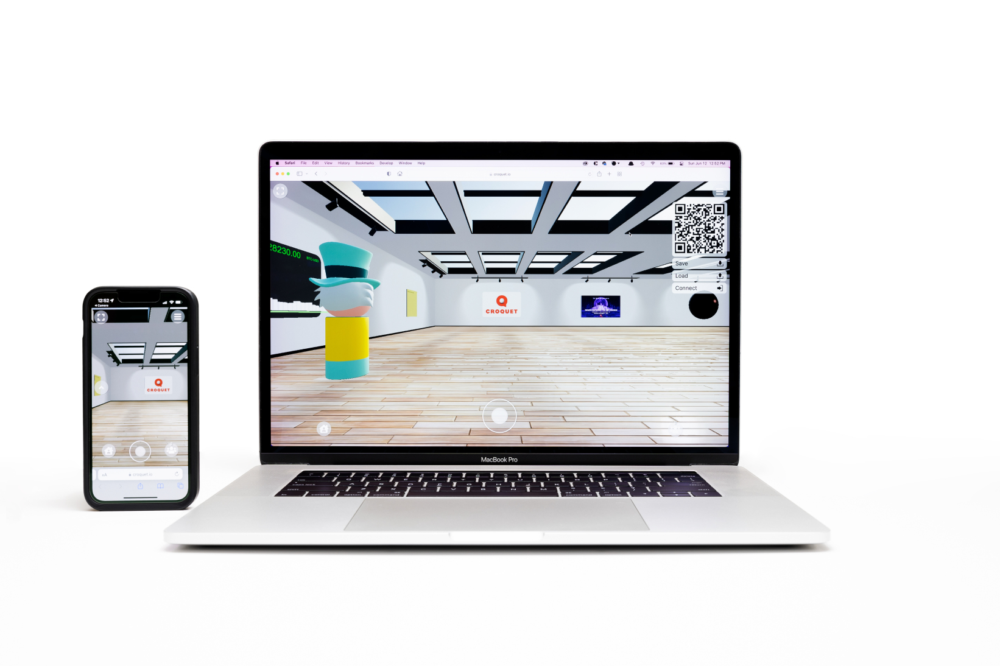

# Croquet Microverse Quick Start Guide

[https://croquet.io](https://croquet.io)

## TL;DR

* `npm create croquet-microverse@latest`
* `npm start`

---
## Introduction

This guide will enable you to quickly set up your own Croquet Microverse project. Refer to tutorials in the [docs directory](index.md) for its key concepts and features that let you build shared worlds.

### Prerequisites

1. [Node.js](https://nodejs.org/)
2. Web browser (we recommend [Chrome](https://chrome.google.com/) at this time)

Our tools are written in JavaScript and need Node.js to run. In particular the `npm` command provided by Node is used to install JS packages.

The users of your worlds do not need these tools. Microverse worlds are deployed as static web pages so only a web browser is needed to visit them.

---
## Installation Steps

1. Create an empty directory for your project.
2. In that directory, run the following command:

       npm create croquet-microverse@latest

   This will create a ready-to-use folder structure for your project.

---
## Video Walkthrough
Here's a video walkthrough of the steps: [vimeo.com/739770287](https://vimeo.com/739770287)


[](https://vimeo.com/739770287)

---
## Try your project locally

In the directory you just created, run

    npm start

This will start the development web server. In its output there will be lines like:

    Running at:
        http://127.0.0.1:9684
        http://192.168.0.105:9684
        http://[::1]:9684

Copy the Network URL (e.g. `http://192.168.0.105:9684/`) and paste it into your web browser. We recommend using this URL over the `localhost` one to be able to join the session from other devices, e.g. your phone.

Congratulations!

<p align="center">

</p>

---

## Deploy your world to a web server

A Croquet app like Microverse is deployed as a static web app. You do not need any special server-side features.

1. Create a production key at [croquet.io/keys](https://croquet.io/keys/) and add a restriction to your target URL. Then create a file called apiKey.js (from apiKey.js-example) and paste your key into the value of `apiKey`.

You can pick your own `appId`. We recommend to make a unique appId.

```JavaScript
        /* Copy this into a file named apiKey.js */
        const apiKey = '123abcd_Get_your_own_key';
        const appId = 'com.mycompany.myorg.myapp';
        export default {apiKey, appId};
```

2. Upload the whole project directory to any web server.

    One simple way is GitHub pages. Check your directory into git, publish to GitHub, and enable [pages](https://pages.github.com).

    Here's an example
    * code: [github.com/codefrau/microverse-neon](https://github.com/codefrau/microverse-neon)
    * live: [codefrau.github.io/microverse-neon](https://codefrau.github.io/microverse-neon/)

    Note: you see I checked in my `apiKey.js`. Unlike server-side API keys, client-side API keys are not a secret. Anyone looking at the code on your website can see it. Instead, it is protected by the URL restriction, it will only work on your own website, not on anyone else's (if they were to copy it).

---
## Updating

In your project directory run

    npm i @croquet/microverse-library@latest

This will update your `package.json` and the installed version of Microverse to the latest. Then copy the updated `node_modules/@croquet/microverse-library/lib` directory again as described above.

---
## Resources

### Documentation
  - [Microverse](index.md) tutorials etc.
  - [CroquetOS](https://croquet.io/docs/croquet/) the underlying multiplayer OS
  - [WorldCore](https://croquet.io/docs/worldcore) the underlying game engine

### Help

   The best resource for help in developing Croquet Microverse worlds is our Discord community. The Croquet Discord server is where you can chat with fellow developers, ask questions, and show off your own creations. Join the [Croquet Discord server](https://croquet.io/discord/).

**Copyright (c) 2022 Croquet Corporation**
