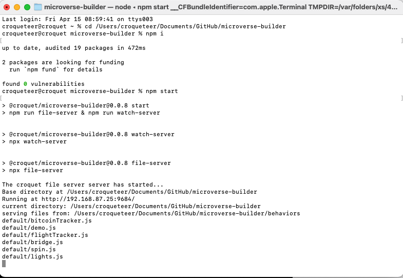
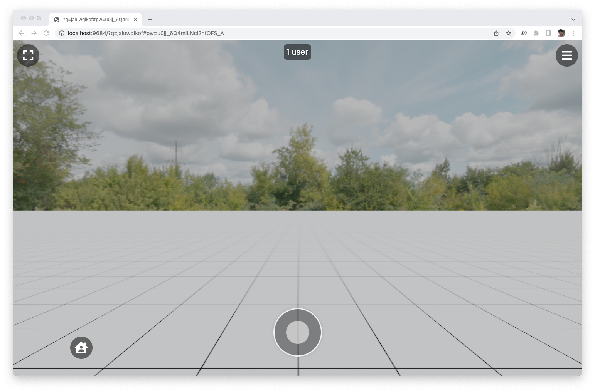
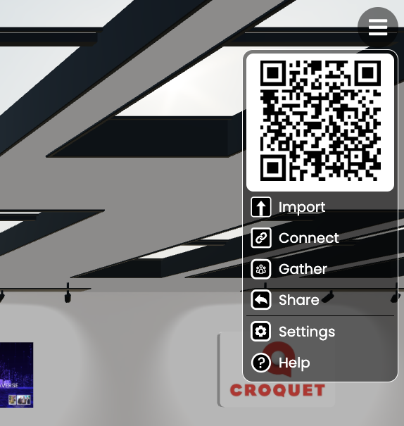

# Croquet Microverse Builder
## Tutorial

Microverse Alpha

**Copyright (c) 2022 Croquet Corporation**

[https://croquet.io](https://croquet.io)

## TO BE DONE
1. Discuss Actor/Pawn development model
2. xTutorial 2 - construct a 3D model world
3. xTutorial 3 - extend the card to interact with user (random color)
4. xTutorial 4 - flamingo + Circle
5. xTutorial 5 - more complex behavior
6. xTutorial 6 - live data visualization
7. xTutorial 7 - external data stream
8. Card Properties

## Introduction

The Croquet Microverse is a browser-based 3D shared experience platform and OS. It includes the ability to collaboratively create 2D and 3D multi-user experiences. It runs on PCs, mobile devices including tablets and smartphones, and AR/VR devices.

This guide will enable you to quickly set up Croquet Microverse Builder and introduce you to a number of key concepts that you will need to know to create your own worlds and apps within those worlds. Not only is it easy to do this, it is incredibly fun and rewarding.

## TLDR
1. Clone the GitHub repository https://github.com/croquet/microverse
    <br>(`git clone https://github.com/croquet/microverse`)
2. Obtain your Croquet API Key https://croquet.io/keys/
3. Open a terminal and set the path to your new Microverse-Builder folder.
   <br>`cd microverse`
4. Create the apiKey.js file from apiKey.js-example and the API Key above.
   <br>`cp apiKey.js-example apiKey.js # and edit apiKey.js`

In the terminal run

```npm i```

and then

```npm start```

Open browser at `localhost:9684` and enter a new world.

5. Connect to your IDE via the Watch Server.

6. Create your own worlds.

## Croquet Microverse
---

Croquet Microverse Builder is a multi-user development and deployment system built on top of the Croquet Web-based operating system. This document will get you started creating your own microverses that you can deploy anywhere you like.

The Microverse Builder IDE can be integrated directly with the tools you are already familiar with, particularly with your own editor. This enables you to directly work with and modify a live, shared Croquet Microverse session.

## Croquet OS
---
The Croquet OS is a software system for creating and deploying multiuser experiences on the web. It lets you build real-time multiuser apps without writing a single line of server code, or deploying or managing any servers. Croquet is available as a JavaScript library that grants access to our global network of public reflectors. These reflectors provide seamless cross-platform real-time interactivity to any user with a network connection and a web browser.


## Resources
---

### Croquet.io
[https://croquet.io/](https://croquet.io) is the best place to get started with what Croquet Microverse is and what it can do.

### Discord

The best resource for help in developing Croquet Microverse worlds is on our Discord server where you can ask questions, view examples, and see the Metaverse being constructed while you watch. Check it out on the [Croquet Discord server](https://discord.gg/9U9MKSbJXS).

## Steps Towards Creating Your Microverse
---

### 1. Clone the GitHub Repository

You can find the most up to date Croquet Microverse library as well as this document in the Microverse-Builder GitHub repository. Cloning this repository will give you almost everything you will need to get started creating your own Croquet Microverse.
[https://github.com/croquet/microverse](https://github.com/croquet/microverse)

---
### 2. Obtain your API Key

Developing any Croquet application requires an API key that you can obtain from Croquet. It requires you to sign up as a developer to access this. You can sign up as a Croquet developer here:
[https://croquet.io/keys](https://croquet.io/keys)

Select the [Create one here](https://croquet.io/keys/) link in the top left to create a Croquet account to get started. Once you have done that, your first key is immediately generated and you will soon be ready to go.


---
### 3. Create the apiKey.js File
Create a file called `apiKey.js` by copying `apiKey.js-example` to `apiKey.js` and then edit the two properties called `apiKey` and `appId` in the file.

#### apiKey.js-example

```
const apiKey = "paste your apiKey from croquet.io/keys";
const appId = "type your own appId such as com.example.david.mymicroverse";
export default {apiKey, appId};

// you may export other Croquet session parameters to override default values.
```

Place your Croquet generated API keys and application ID into this and save the resulting file as apiKey.js.

#### apiKey.js
```
const apiKey = "1_a2b3c4e5f6g7h8i9j0kxyzzyqwerty142nsj6fasdsadad";
const appId = "com.example.david.mymicroverse";
export default {apiKey, appId};
```

### 4. Start Croquet Microverse

The next steps are simple. Open a terminal on your computer and change the working directory to the new microverse folder. (`cd microverse')

First run `npm install` in the directory.

Then run `npm start` in the same directory. This will run two servers. One is the file server on localhost:9684. The other is the watch-server that enables you to inject code changes into a running session. You can also run them separately by running `npm run file-server` and `npm run watch-server`.

You should see something similar to this:



Not only have you completed installation of Croquet Microverse Builder, but you can run it right now to give it a try. Open your web browser and type in:

`localhost:9684`

Once you have done that, the demo world for Croquet Microverse will load and you are ready to go. The URL will change - both a new session ID and a password are autogenerated. This full URL is what allows you to share your new world with other users.



Your new Microverse awaits...

### 5. The Watch Server
The watch server enables you to edit code from your own IDE and have it injected and run inside the Croquet Microverse while it is running without the need to reload. The watch server is automatically launched when execute `npm start`. You can start the watch server on its own by running `npm run watch-server`. The watch-server by default starts watching the directory called `behaviors`. If you want to create a separate set of behavior files in a different directory, you supply an argument to the watch-server by `npm run watch-server -- aDirectory`.

You can try out the live IDE now with the default world. Simply run `localhost:9684`. Once it is launched you will see a menu icon in the top right corner. Select this and you will see a large QR code underneath which is are three menu items. `Save` and `Load` allow you to save the entire state of the world in a VRSE file (try it) and then load it back into an empty world.



The next item, `Connect` connects directly to the watch-server. Now you can access and modify the behaviors for your world directly from the external IDE. When you save, these changes are directly injected into the world without having to reload. The image below demonstrates adding a comment to the code and having it appear (and run if it were executable) in the code viewer inside of the Microverse world.


Of course you can modify the actual executable dynamically as well. This makes development within Microverse amazingly smooth and fun.

#### Edit or add a new files
You can easily add a new file in the watched directory (by default `behaviors/default/` or your own behaviors directory), and if the file follows the standard behavior structure of other files, it will be automatically available.

### 6. Make Your Own New World
You can add a new file in the "worlds" directory (copying default.js or test.js is an easy way). If you start microverse with ?world=worldFileName, the file at `worlds/worldFileName.js` is used to start the world.

## Worlds, Cards and Behaviors
---
A Croquet World is deployed as a simple website. It is made up of a collection of cards, behaviors and 2d and 3d content. When you create a new world using Croquet Microverse Builder, every action, object and event is multiuser by default. You can think of the world you are constructing as a template. Once you deploy your Microverse and launch it, it will automatically generate a new session ID which is also added to the URL. Sharing this full URL enables other users to join the world with you any time.

### Cards

Every visible object in a Microverse is a kind of card. Some cards are flat like normal cards, and some are 3D models. We call them cards because the majority of the applications and interface objects will be flat. Also, we were inspired by Bill Atkinson's Hypercard, which demonstrated a new way of creating powerful applications.

<!--- All cards are composable in that the developer can create decks made up of multiple cards that can interoperate with each other. The cards in this deck can communicate with each other using a simple publish/subscribe model call "sayDeck" and "listenDeck". -->

Cards can have virtually any shape. As a simple example, you can define a card using a regular SVG shape. The resulting card may be flat or can be extruded - depending on the depth property.

Cards can contain other cards - for example, a button object can be defined that is “contained” by another card. Any card can contain another card, defining a hierarchy. The bottom-level card is the root card.

Cards can manage events - users can interact with them or their leaves. For example, a slider widget is a kind of card that allows a user to drag a handle back and forth. It is self contained, but will send messages about what state the slider is in as it changes. If another card is a text display card it can scroll based upon where the slider says it is. If another user is moving the slider, then the document will scroll, but the local slider will update as well.

2D cards can have canvases. A canvas on a 2D card can itself be implemented as a full application. The canvas is texture mapped onto the card. When a user interacts with a canvas, it is via a card which forwards the event to the canvas.

<!--- A collection of cards and surfaces with a common root card define a Deck. Cards and surfaces within a deck can communicate with each other via sayDeck/listenDeck messages. -->

### Layers

Layers are lists of cards in the world that correspond to how the cards can be used. A card can be on multiple lists. For example, a card with the 'pointer' property responds to and can be found by pointer events. Thus they are added to the “pointer” layer. They can also, if the developer wishes, be used as a walk surface, so they would also be added to the “walk” layer.

This has the additional benefit of dramatically speeding up certain operations such as ray testing.

The current layers are:

`light` - contains the lighting of the world

`pointer` - objects that can receive events

`walk` - objects that the avatar can walk on top of

`avatar` - contains the avatars in the world

`portal` - this card is a portal into another world

### Behaviors

Behaviors are code objects that can be applied to a card. They enable the card to interact with the user, other cards, and even the live external world. Behaviors are typically short Javascript applications that are very easy to write.

## Actor/Pawn Relationship

An actor is a type of model that automatically instantiates a matching pawn in the view when its created. This means you can focus on what the actor does, and how the pawn looks, without having to worry about how they communicate with each other.

## Note on Persistence
The system stores the "persistent data" about every 60 seconds if there is some activity in the world. When you edit your behavior code, or update the system, Croquet starts a fresh session but re-loads contents from the persistent data. The content in the world file that the world is originally created from is not used to initialize this new session. Consider the world file as the starting point of a world, but editing it does not affect the world once it is created unless you edit it live by connecting as above.

## Croquet Microverse References
Croquet Microverse is built on top of a number of other systems. The most important is the Croquet OS and the Croquet Worldcore framework. It isn't essential that you be familiar with these but you may find them useful in understanding the basis of how Croquet Microverse operates.

[Croquet Documentation Main Page](https://croquet.io/docs/)

The [Croquet OS kernel](https://croquet.io/docs/croquet/) is an extremely low-latency multi-user replicated computation platform.

The [Croquet Worldcore framework](https://croquet.io/docs/worldcore/) defines the actor/pawn architecture underlying the Croquet Metaverse cards.

[Three.js](https://threejs.org) provides the 3D rendering framework. It is an extremely powerful, flexible and well-defined library.

Croquet Microverse utilizes the [Rapier Physics Engine](https://rapier.rs/). Written in Rust and running in WebAssembly, Rapier is an open source, very high-performance but easy to create multiuser, interactive physics simulations.


## Constructing New Worlds

The following tutorials will provide a great start to creating your own living Microverse. Let's get started.

* [Tutorial1.md](./Tutorial1.md)
* [Tutorial2.md](./Tutorial2.md)