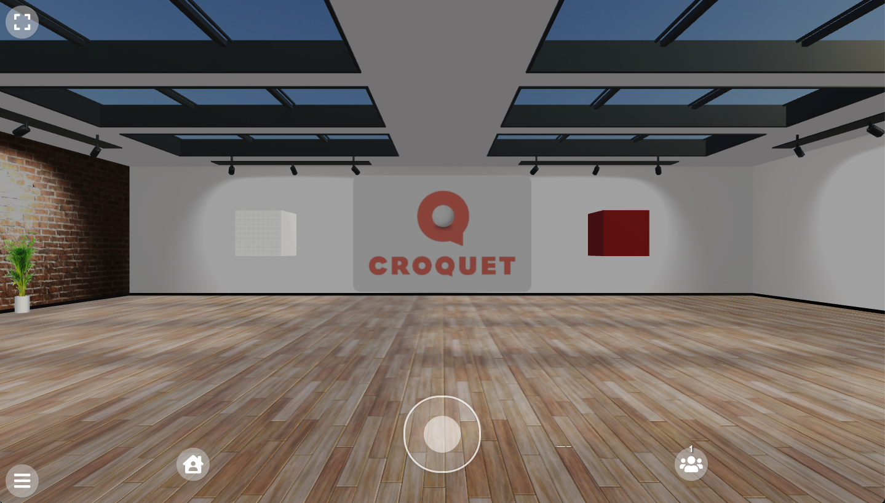

# Croquet Microverse Tutorial 2

[https://croquet.io](https://croquet.io)

## Introduction

In this next tutorial, we will load a 3D model of a gallery where we will place a number of objects. We will also define a number of new behaviors that will add a simple interaction to the objects in that world.

You can try it out right now. The launch URL is:

[http://localhost:9684/?world=tutorial2](http://localhost:9684/?world=tutorial2)

Here is an image of the world we will be constructing:



We are adding some new behaviors to the cards in this world. The "joeTheBox.js" behavior demonstrates how to directly construct a 3D object. The "simpleSpin.js" behavior demonstrates how a simple user interaction triggering an object to spin around its main axis. We will dive into these behaviors shortly.

```
    Constants.UserBehaviorDirectory = "behaviors/tutorial";
    Constants.UserBehaviorModules = [
        "lights.js", "joeTheBox.js", "simpleSpin.js"
    ];
```

## Cards

There are a number of additional cards defined in this world, but everything is still quite simple. Let's start with the definition of the gallery.

```javascript

    Constants.DefaultCards = [
        {
            card: {
                name: "world model",
                type: "3d",
                dataLocation: "./assets/3D/artgallery_042122.glb.zip",
                dataScale: [1,1,1],
                singleSided: true,
                shadow: true,
                layers: ["walk"],
                translation: [0, -1.7, 0],
                shadow: true,

                placeholder: true,
                placeholderSize: [100, 0.01, 100],
                placeholderColor: 0xcccccc,
                placeholderOffset: [0, -1.7, 0],
            }
        },

```

As you can see, this is a bit more complex than the previous creation of the simple grid floor, but not that much.

```javascript
type: "3d",
dataLocation: "./assets/3D/artgallery_042122.glb.zip",
dataScale: [1,1,1],
```

The most important change is we are now referencing a 3D model that is in our assets folder. This is the model of the gallery and was originally created in Blender and exported as a single GLB file including textures. It was then zipped for faster transfer.

We also specify that the type is "3d", so that the file loader has some hint of how to manage it.

We set dataScale: to [1,1,1] as that tells the importer that one unit in the model corresponds to one unit in the world - in this case, both are in meters.

The placeholder fields are there to define a floor to allow the avatars to walk around while the rest of the scene is loading. The placeholder is just a version of the grid floor we saw in Tutorial 1. We define the size, color and offset of the floor here.

The next two cards - the light card and the image card are exactly the same.

```javascript
{
    card: {
        name: "light",
        layers: ["light"],
        type: "lighting",
        behaviorModules: ["Light"],
        dataLocation: "./assets/sky/shanghai_riverside_2k.exr",
        dataType: "exr",
    }
},
{
    card: {
        name: "image card",
        translation: [0, 0.4, -10],
        //rotation: [0, Math.PI / 2, 0],
        scale: [4, 4, 4],
        type: "2d",
        textureType: "image",
        textureLocation: "./assets/images/CroquetLogo_RGB.jpg",
        fullBright: true,
        frameColor: 0xcccccc,
        color: 0xbbbbbb,
        cornerRadius: 0.05,
        depth: 0.05,
        shadow: true,
    }
},
```

The two new cards are different however. The first card is the "Joe the Box" card which is defined by a behavior similar to the grid floor that we saw earlier. Also note that Joe includes the "SimpleSpin" behavior. The second box is loaded from the 3D assets in the same way that the gallery itself was loaded.

```javascript
{
    card: {
        name: "Joe the Box",
        behaviorModules: ["JoeTheBox", "SimpleSpin"],
        layers: ["pointer"],
        type: "object",
        translation: [-4, 0.4, -10],
        shadow: true,
    }
},
{
    card: {
        name: "Imported Box",
        type: "3d",
        dataLocation: "./assets/3D/testcube_1m.glb.zip",
        layers: ["pointer"],
        translation: [4, 0.4, -10],
        dataScale: [1,1,1],
        shadow: true,
    }
},

```

## Behaviors

There are two new behaviors for us to explore. The first is "joeTheBox", a very simple pawn construction behavior. This version of Joe has no simulation or shared interactions associated with it, thus there is no actor behavior. The second is "simpleSpin", a simple actor user interaction and simulation behavior. SimpleSpin is focused on user interaction and simulation, so this has no pawn behavior. The introductory tutorial has an overview of the actor and pawn system and their relationship.

[Tutorial Intro: Actor Pawn Relationship](./Tutorial1.md#actor-pawn-relationship)

## Joe

This is first version of the "joeTheBox.js" behavior. We will introduce more advanced versions of Joe in later tutorials. Joe is not a very large file - all it does is construct a 3D cube using the Three.js library. [https://threejs.org] We won't go into detail here about how to construct 3D objects. There are many great tutorials on how to use Three.js.


```javascript
class JoeTheBoxPawn {
    setup() {
        console.log("Building JoeTheBox");
        const THREE = Microverse.THREE;
        const gridImage = './assets/images/grid.png';
        const texture = new THREE.TextureLoader().load(gridImage);
        texture.wrapS = THREE.RepeatWrapping;
        texture.wrapT = THREE.RepeatWrapping;
        texture.repeat.set(10, 10);

        this.box = new THREE.Mesh(
            new THREE.BoxGeometry(1, 1, 1, 1, 1, 1),
            new THREE.MeshStandardMaterial({ map: texture, color: 0xcccccc }));
        this.box.receiveShadow = true;
        this.box.castShadow = true;
        this.shape.add(this.box);
    }
}

export default {
    modules: [
        {
            name: "JoeTheBox",
            pawnBehaviors: [JoeTheBoxPawn],
        }
    ]
}
```


A behavior has a very simple class structure. The setup() function is guaranteed to be called whenever JoeTheBox is created or whenever it is changed. If you are modifying this behavior in your code editor, when you save the updated code, the setup() function will be called again.

Notice that the THREE library object is accessed via the Microverse shared object. Though Microverse is not defined here, it is passed into the behavior automatically. The THREE library is an example of an object that can be accessed.

This code uses the Three.js libray to create a cube and add a grid texture to it. Once it is constructed, we add the new cube to this.shape, which is added to the three.js scene.

The last thing to do is define the export of the module containing the behavior. This enables the Croquet system to find and access these behaviors so that the can be applied to the new card.

## SimpleSpin

The next behavior demonstrates an actor side user interaction behavior. This behavior is a bit more complex than Joe, but it will illustrate some of the most amazing features of the Croquet OS. The simpleSpin

```javascript
class SpinningActor {
    setup() {
        this.spinning = false; // start without spinning
        this.angle = 0; // the initial angle
        this.spinSpeed = 0.01; // how fast will we spin (in radians)
        this.addEventListener("pointerDown", "toggle");
    }

    step() {
        if (!this.spinning) return;
        this.future(20).step();
        this.angle+=this.spinSpeed;
        this.set({rotation: Microverse.q_euler(0, this.angle, 0)});
    }

    toggle() {
        this.spinning = !this.spinning;
        if (this.spinning) this.step();
    }

    teardown() {
        this.removeEventListener("pointerDown", "toggle");
        this.spinning = undefined;
    }
}

export default {
    modules: [
        {
            name: "SimpleSpin",
            actorBehaviors: [SpinningActor],
        }
    ]
}
```

The setup() function initiates a number of variables that simpleSpin will be using.

Setup also initiates the user event "pointerDown". When a user clicks or taps the card, the "toggle" function will be called. In this case, the toggle function flips the "spinning" variable from true to false and back. If ```this.spinning``` is set to true, then the ```step()``` function is called which is where the interesting stuff happens. ***The code in an actor behavior runs bit identically on every participating machine*** - if I tap the box the SpinningActor behavior is attached to, you will not just see it begin to spin, but the spin will be perfectly replicated on your system and mine.

The step() function first tests if it is spinning or not. The next line is one of the central aspects of how the Croquet OS runs and maintains perfect synchronization.

```this.future(20).step();```

The Croquet OS works by guaranteeing synchronization of simulations and user events. This is done by moving the system clock over to a kind of server we call a Croquet reflector. The reflector will send two kinds of events - those initiated by the user in their client and sent to the reflector for distribution to the other participants in a session and regular tick update events - these tick update rate is set when the world is first initiated. The default tick update rate for Croquet Microverse worlds is 30 Hz. This is not the same as the render update rate which is determined by the speed of your display and your CPU/GPU. Both of these events include a timestamp that informs the client side of the system to what time to compute its pending simulations. These simulations run bit identically and "virtually" simultaneously on every users system.

The next two lines are the actual update of the rotation of the target object.

```javascript
        this.angle += this.spinSpeed;
        this.set({ rotation: Microverse.q_euler(0, this.angle, 0) });
```

We add the spinSpeed to the current angle, then we inform the actor that the rotation has been updated using the ```this.set()``` function. The rotation field requires a quaternion, so we use the ```Microverse.q_euler()``` function to generate a quaternion from this.angle around the y-axis. Worldcore does the work of informing the pawn that the rotation has been changed, so our target object - the cube, starts rotating.

The Microverse platform was built on Worldcore, so it would be useful for you to have some familiarity with it as well. The documentation for Worldcore is available here:

https://croquet.io/docs/worldcore/

The last thing we want to do is enable you to remove the SimpleSpin behavior. The teardown() function is called when a behavior is removed. Here we can first remove the pointerDown event listener and then set this.spinning to be undefined.

```javascript
        this.removeEventListener("pointerDown", "toggle");
        this.spinning = undefined;
```

**Copyright (c) 2022 Croquet Corporation**

